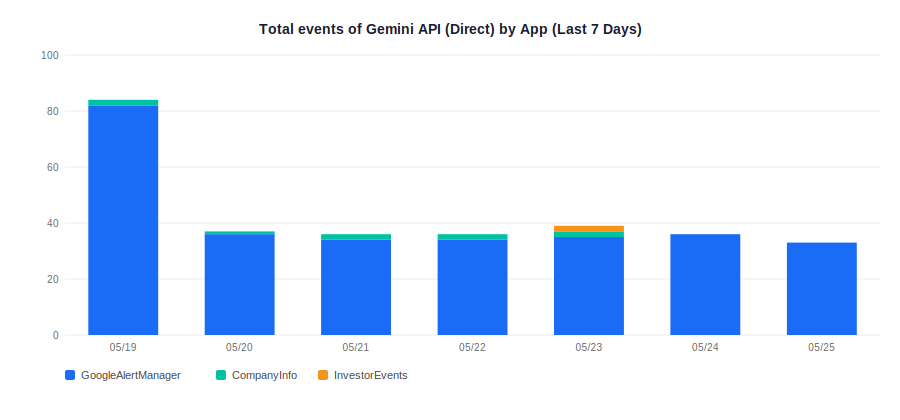
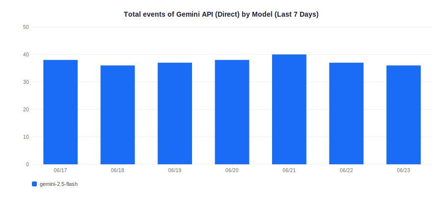
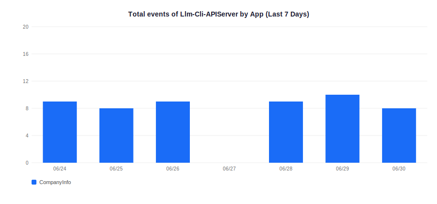
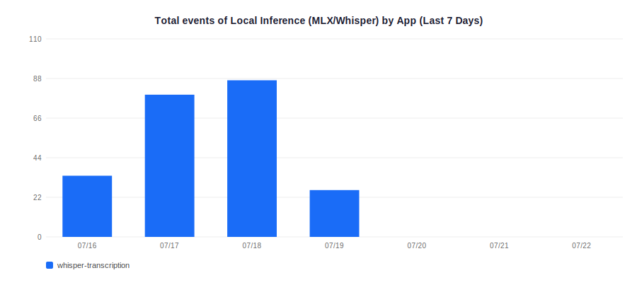

# llm

一個統一的 LLM 客戶端函式庫，封裝了 **Gemini API** (具備金鑰輪轉功能)、**LLM-CLI-API-Server** (封裝 `codex-cli` 與 `gemini-cli` 的橋接器) 以及 **MLX** (本地 Apple Silicon 推論)。

## 🌟 核心特色

- **自動備援鏈 (Fallback Chain)**：預設路徑為 `codex` → `gemini` → `mlx`。當高優先級的 CLI 橋接或 API 失敗時，自動切換至備援方案。
- **Gemini 金鑰輪轉**：支援多達 20 把 API Key (`GEMINI_API_KEY` + `_1` 到 `_19`)，具備每日配額偵測與 Round-robin 輪轉機制。
- **CLI 橋接功能 (LLM-CLI-API-Server)**：
    - **ChatGPT Pro**：透過伺服器端的 `codex-cli` 調用具備訂閱權限的 ChatGPT。
    - **遠端 Gemini**：透過伺服器端的 `gemini-cli` 調用 Gemini (適用於 IP 受限或需集中管理金鑰的場景)。
- **本地 MLX 推論**：支援連線至 `MLX-API-Server` 進行本地高效能推論。
- **數據分析**：整合 Amplitude，自動追蹤每次調用的 Provider、模型、耗時、Token 數與成功率。
- **智慧路由 (Smart Routing)**：自動評估與優化推論路徑。透過「先評審、後晉升」機制，在確保品質的前提下，自動切換至更經濟或快速的模型（如本地 MLX 或 NAS 上的 Gemini-CLI），並支援 NAS 端的「自我反思」加速。
- **結構化輸出**：所有 Provider (包含 CLI 橋接) 均支援 `JSON Mode`，確保回傳資料符合預期的 Schema。

---

## API Usage Statistics

*Powered by [Amplitude Analytics](https://amplitude.com) · Updated: 2026-05-11 09:30 CST*


### Gemini API (Direct)

| Model | Total Calls | Avg Duration |
|-------|-------------|--------------|
| `gemini-2.5-flash` | 3079 | N/A |
| `gemini-2.0-flash` | 10 | N/A |
| `gemini-2.5-flash-lite` | 3 | N/A |

#### Top Applications

| Application | Total Calls |
|-------------|-------------|
| GoogleAlertManager | 2783 |
| CompanyInfo | 240 |
| InvestorEvents | 22 |
| ConceptStocks | 18 |
| TAIEX_Finguider_Pro | 16 |
| llm-api | 8 |
| TravelAPP | 3 |
| TestSmartRouting | 2 |






### Llm-Cli-APIServer

| Model | Total Calls | Avg Duration |
|-------|-------------|--------------|
| `codex` | 616 | N/A |
| `chatgpt-pro` | 150 | N/A |

#### Top Applications

| Application | Total Calls |
|-------------|-------------|
| whisper-merge-review | 616 |
| TAIEX_Finguider_Pro | 53 |
| GoogleAlertManager | 27 |
| llm-api | 22 |
| ServerSmartTest | 14 |
| InvestorEvents | 11 |
| TAIEX_Finguider_Gen | 7 |
| TAIEX_Visualizer | 7 |
| SmartTest | 6 |
| TAIEX_Compare | 1 |




### Local Inference (MLX/Whisper)

| Model | Total Calls | Avg Duration |
|-------|-------------|--------------|
| `whisper-large-v3` | 774 | N/A |
| `mlx-qwen3` | 43 | N/A |
| `mlx-gemma4` | 20 | N/A |
| `mlx-community/whisper-large-v3-turbo` | 11 | N/A |
| `whisper-large-v3-turbo` | 6 | N/A |
| `distil-whisper-large-v3` | 1 | N/A |

#### Top Applications

| Application | Total Calls |
|-------------|-------------|
| whisper-transcription-stage | 579 |
| whisper-transcription | 180 |
| whisper-poc-sample | 33 |
| eval-gemma4 | 26 |
| test-mlx | 20 |
| SmartTest | 8 |
| test-mlx-gemma4 | 5 |
| TAIEX_Finguider_Pro | 4 |




## 📦 安裝方式

### 選項 A：本地路徑 (開發環境)

在 `pyproject.toml` 中加入：
```toml
[project]
dependencies = [
    "llm @ file:///${PROJECT_ROOT}/../llm",
]
```

或使用 uv：
```bash
uv add --editable "../llm"
```

### 選項 B：GitHub 倉庫 (CI/CD 或正式環境)

```toml
[project]
dependencies = [
    "llm @ git+https://github.com/wenchiehlee/llm.git",
]
```

---

## ⚙️ 環境變數設定

請複製 `.env.example` 並更名為 `.env`。**注意：API Key 中若包含 `#` 字元可能導致解析錯誤，請確保 Key 的正確性。**

### 1. Gemini (直接調用 API)
- `GEMINI_API_KEY`: 主要金鑰。
- `GEMINI_API_KEY_1` ... `19`: 額外的輪轉金鑰。
- `GEMINI_SKIP_KEYS`: 以逗號分隔，指定要手動跳過的金鑰名稱。

### 2. LLM CLI API Server (遠端 CLI 橋接)
- `CODEX_API_URL`: 伺服器網址 (例如 `https://api.wenchiehlee.synology.me:8443`)。
- `SERVER_API_KEY`: 存取伺服器的驗證金鑰。
- *註：伺服器需預先安裝 `codex-cli` 與 `gemini-cli`。*

### 3. MLX API Server (本地推論)
- `MLX_API_URL`: MLX 伺服器網址。
- `MLX_SERVER_API_KEY`: 驗證金鑰。

### 4. 監控與分析 (選填)
- `AMPLITUDE_API_KEY`: Amplitude 專案金鑰。
- `LLM_APP_NAME`: 應用程式名稱，用於區分流量來源。

---

## 🚀 使用範例

### 基礎調用
```python
from llm import LLMClient

# 初始化 (自動偵測可用 Provider：codex → gemini → mlx)
client = LLMClient(app_name="NewsAnalyzer")

# 普通文本生成 (預設會先嘗試透過 codex-cli 使用 ChatGPT Pro)
text = client.generate("請簡述台積電在 2024 年的營收表現。")

# JSON 模式 (回傳 dict 或 list)
data = client.generate_json("分析此標題的感興趣程度：'新一代 AI 晶片發表'，格式：{score: 0-10, reason: str}")

# 智慧路由 (Smart Routing)
# 1. 本地優化：讓 MLX 生成，再交由強大模型評分。達標後自動永久切換為 MLX。
text = client.generate_smart("TaskA", "請將這段文字翻譯成英文：...", draft_provider="mlx")

# 2. NAS 端自我反思 (極速模式)：在 NAS 內部完成 gemini-cli -> gemini-cli 的產生與評核
# 消除網路來回延遲，且不消耗 Gemini API 直接配額。
text = client.generate_smart("TaskB", "請摘要此內容...", draft_provider="codex")
```

---

## 🧠 智慧路由 (Smart Routing) 詳細說明

智慧路由旨在「品質不妥協」的前提下，自動將流量導向最經濟或最快速的路徑。

### 1. 核心機制：草稿與評審 (Draft & Judge)
*   **草稿階段**：使用較快/便宜的模型（如 `mlx` 或 `gemini-cli`）產生初步回答。
*   **評審階段**：將草稿送交強大模型（預設為 `codex-cli`，自動避開直接呼叫 `gemini` API 以節省配額）進行評核。
    *   若評審回覆 **"OK"**：紀錄成功，回傳草稿。
    *   若評審回覆失敗：紀錄失敗，回傳評審修正後的答案。

### 2. 晉升機制 (Promotion)
當特定任務（Task Name）表現穩定（預設樣本 > 10 次且成功率 > 80%）時，系統會將該任務「晉升」。後續呼叫將**直接執行草稿模型**，完全跳過評審步驟。

### 3. 效能優化：伺服器端路由
當 `draft_provider` 設為 `"codex"` 時，`llm` 會自動將整個路由邏輯交給 NAS 端的 `Llm-Cli-APIServer` 處理。這使得「自我反思」流程（如 `gemini-cli` 產生並由 `gemini-cli` 評審）完全在伺服器內部瞬間完成，對客戶端而言僅有一次網路請求的延遲。

### 4. 如何啟用？(Migration Guide)
使用者僅需將原本的 `generate()` 呼叫改為 `generate_smart()`，並指定一個具代表性的 **`task_name`**：

*   **舊寫法** (無優化)：`res = client.generate("請翻譯...")`
*   **新寫法** (智慧路由)：`res = client.generate_smart("translation_task", "請翻譯...", draft_provider="codex")`

系統會自動管理 `.llm_routing.json` 狀態文件。一旦任務達成晉升條件，後續呼叫將自動切換至最速路徑，使用者無需手動干預。
```

### 指定路徑與模型
```python
# 強制指定使用 Codex 伺服器上的 gemini-cli 調用 Gemini 2.5
client = LLMClient(providers=["codex"], model="gemini-2.5-flash")
text = client.generate("透過 NAS 伺服器上的 gemini-cli 進行調用。")

# 查詢最後一次調用的詳細資訊
print(f"Provider: {client.last_provider}")  # 會顯示 'codex'
print(f"Model: {client.last_model}")        # 會顯示 'gemini-2.5-flash'
```

---

## 🧪 測試與驗證

專案提供多個測試腳本以驗證不同路徑的整合狀態：

- `python test_llm_cli.py`: 驗證 `Llm-Cli-APIServer` 的 `codex-cli` (ChatGPT) 路徑（自動偵測可用 provider）。
- `python test_llm_cli_gemini.py`: 驗證 `Llm-Cli-APIServer` 的 `gemini-cli` (Gemini) 路徑。
- `python test_mlx.py`: 驗證本地 MLX 伺服器路徑。

---

## 📊 支援清單

| Provider | 預設模型 | 內部工具 / 說明 |
| :--- | :--- | :--- |
| `codex` | `chatgpt-pro`/`gemini` | 透過橋接伺服器調用。內部封裝 `codex-cli` (ChatGPT Pro) 與 `gemini-cli` (Gemini)，模型設為 `gemini-*` 時自動切換。 |
| `gemini` | `gemini-2.5-flash` | 直接調用 Google Gemini API，支援多金鑰自動輪轉。 |
| `mlx` | `mlx-qwen3` / `mlx-gemma4` | 調用本地 Apple Silicon 設備上的 MLX 推論伺服器。 |
